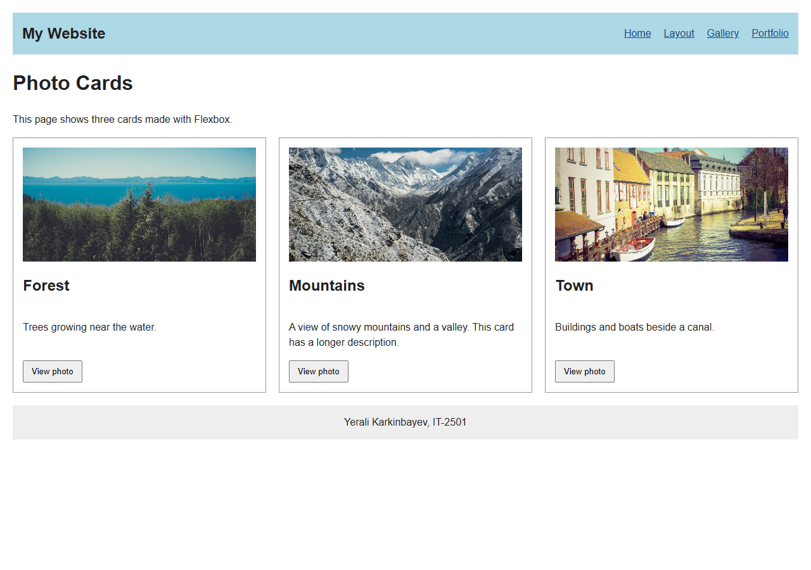
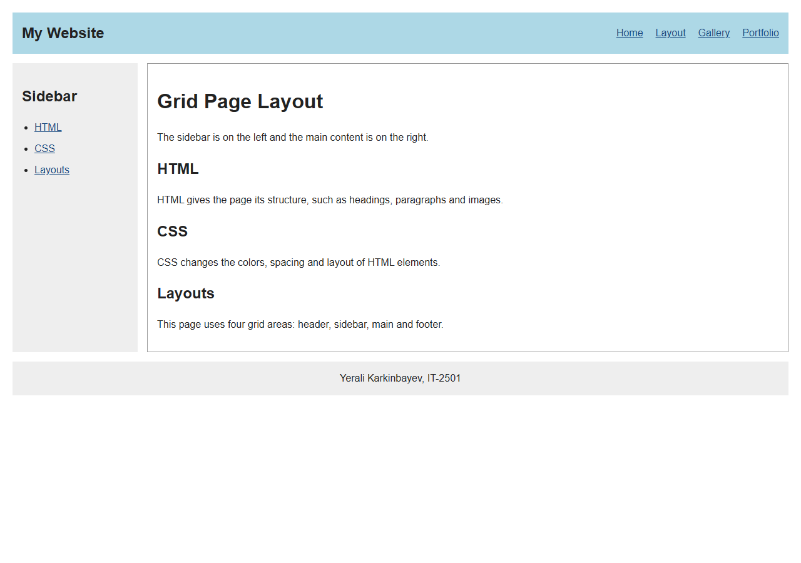
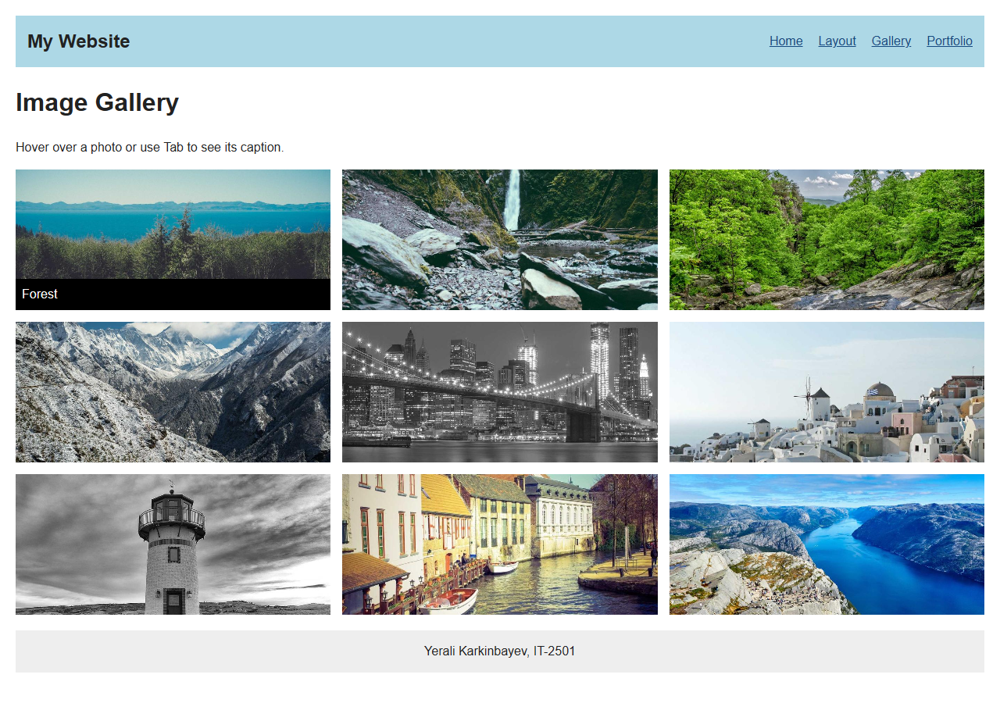
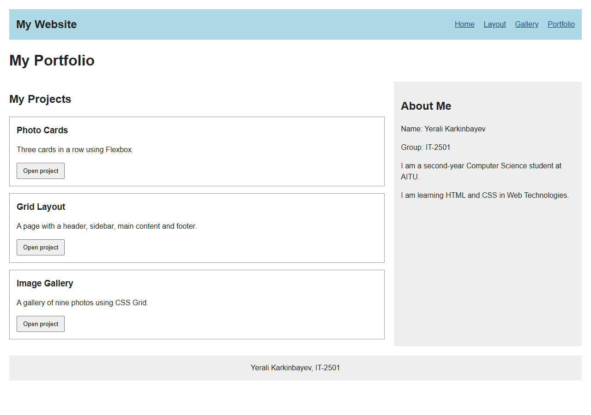

# Assignment 2

Name: Yerali Karkinbayev  
Group: IT-2501  
Course: Web Technologies

## How to open

Download and extract the project, then open `index.html` in a browser. Keep all the folders together. No installation is needed.

## Part 1: Flexbox

### Task 0: Navigation Bar

The header uses Flexbox. The logo is on the left and the links are on the right. `align-items: center` centers them vertically, and `gap` adds space between the links.

### Task 1: Card Row

There are three cards with an image, title, text and button. Flexbox gives the cards equal height in the desktop row. A shadow appears on hover. The buttons open the photos in the gallery.

## Part 2: Grid System

### Task 2: Page Layout with Grid Areas

This page uses four named areas: header, sidebar, main and footer. The sidebar is on the left. The header and footer cover both columns.

### Task 3: Image Gallery

The gallery uses three equal columns and 180px rows. There are nine photos with 15px gaps. Hovering over a photo shows its caption.

## Part 3: Combining Flexbox and Grid

### Task 4: Portfolio Page

The header uses Flexbox. The main part uses Grid, with projects on the left and information about me on the right. Each project card uses a column Flexbox layout.

## Work summary

The pages use the same CSS file. The main steps were creating the HTML, adding the Flexbox and Grid layouts, and checking the pages in a browser. A small JavaScript function opens the pages when a card button is clicked.

On screens up to 600px wide, the cards and grid columns stack vertically. The pages were checked at desktop and phone sizes, including the links, buttons and image captions.

## Photo credits

Photos are from [Lorem Picsum](https://picsum.photos/), under the [Unsplash License](https://unsplash.com/license). Photographer names and original links come from Picsum's image information.

- Forest: [Paul Jarvis](https://unsplash.com/photos/6J--NXulQCs)
- Waterfall: [Paul Jarvis](https://unsplash.com/photos/NYDo21ssGao)
- Green valley: [Jerry Adney](https://unsplash.com/photos/_WiFMBRT7Aw)
- Mountains: [Go Wild](https://unsplash.com/photos/V0yAek6BgGk)
- City: [Oleg Chursin](https://unsplash.com/photos/IoCWq07GaG4)
- Village: [Margaret Barley](https://unsplash.com/photos/Qo51KwK1dKg)
- Lighthouse: [Tony Naccarato](https://unsplash.com/photos/-kEr-QltARg)
- Canal town: [Linh Nguyen](https://unsplash.com/photos/agkblvPff5U)
- Fjord: [Alexey Topolyanskiy](https://unsplash.com/photos/-oWyJoSqBRM)
